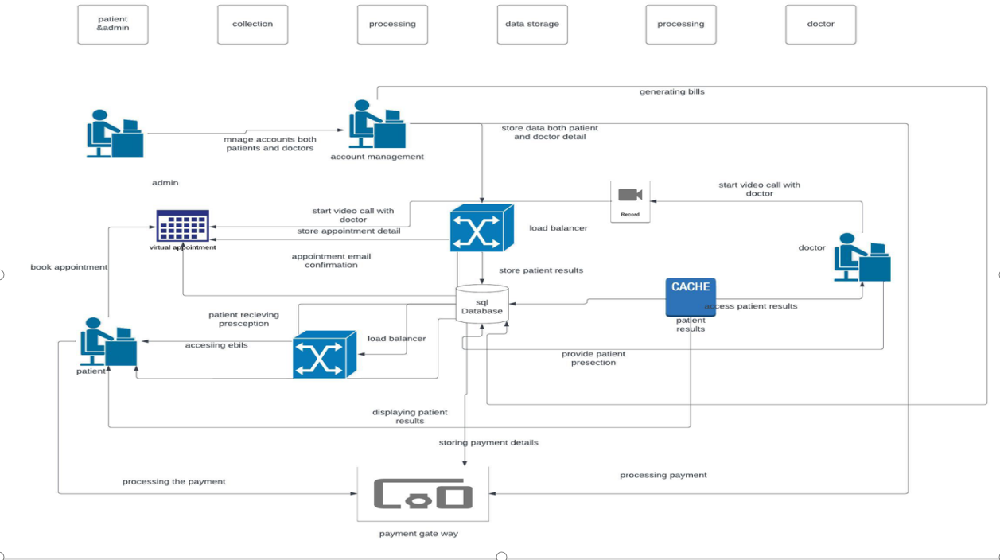

# SimplePractice Project

SimplePractice is a healthcare platform designed to streamline scheduling, billing, client management, and telehealth services.  
This repository contains the architecture model and user stories for a secure, user-friendly solution.

## Key Features
- **Scheduling**: Efficient appointment management for practitioners and clients.  
- **Billing**: Automated billing processes.  
- **Client Portal**: Secure online access for clients.  
- **Mobile App**: User-friendly app for on-the-go access.  
- **Telehealth Integration**: Secure video conferencing for remote care.  
- **Security**: HIPAA-compliant encryption and authentication.  
- **Documentation & Measurement-based Care**: Tools for streamlined workflows.  

## Architecture

The system is designed with scalability and security in mind.  
Below are the architecture diagrams:

  
  

📄 See details here: [Architecture Model](architecture/architecture_model.md)  

## User Stories

User stories define how clients and practitioners interact with the system.  

Example screenshots:  

  
  
  
  
  

📄 See details here: [User Stories](architecture/user_stories.md)  

## Repository Structure
architecture/ # Architecture model + diagrams
architecture_model.md
user_stories.md
architecture1.png
architecture2.png

images/ # User story screenshots
userstory1.png
userstory2.png
userstory3.png
userstory4.png
userstory5.png

## Development Process
- **Sprint 1**: Database and initial setup.  
- **Sprint 2**: Core features and UI design.  
- **Sprint 3**: Telehealth and security implementation.  

## How to Contribute
```bash
# Clone the repository
git clone https://github.com/yogya111/SimplePractice-Project.git

# Create a branch
git checkout -b feature/add-architecture-diagrams

# Add files
git add architecture/ images/

# Commit
git commit -m "Add architecture diagrams and user story screenshots"

# Push
git push origin feature/add-architecture-diagrams
## Tools Used

- **Notepad++** → Markdown and code editing
- **Draw.io** → Architecture diagrams
- **Git** → Version control
- **Microsoft Word / Jira** → User stories
